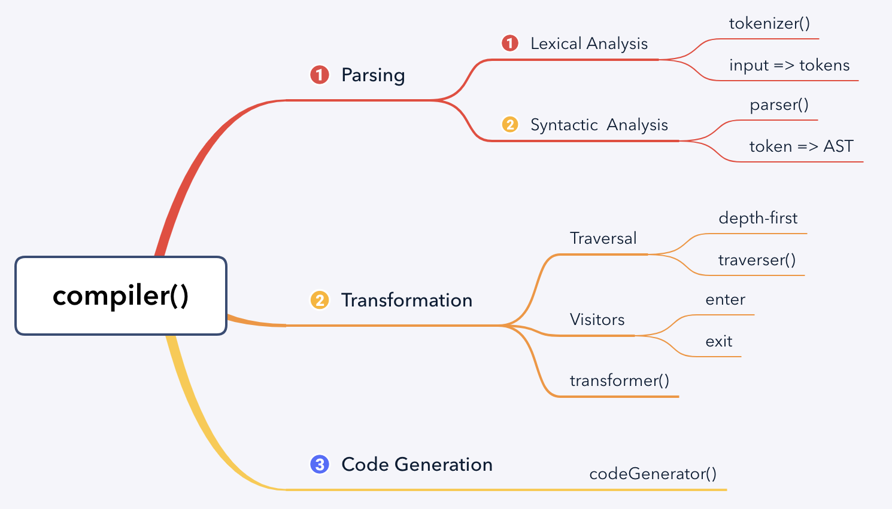

# The Super Tiny Compiler

主文件只有一个：[`the-super-tiny-compiler.js`][2]。

该编译器可以把类 lisp 语法，转译为类 C 语法。比如：

```
(add 2 2)               =>  add(2, 2)
(subtract 4 2)          =>  subtract(4, 2)
(add 2 (subtract 4 2))  =>  add(2, subtract(4, 2))
```



大部分编译器可以拆分为三个主要阶段：

1. **Parsing** 读取源码，并将其转为较抽象的代码。
1. **Transformation** 转换语法，超空抽象代码
1. **Code Generation** 产生目标码

parsing 又能细分为两个阶段：

1. **Lexical Analysis** 词法分析。使用分词器把原始代码拆分为 token 数组。
1. **Syntactic Analysis** 语法分析。读取 tokens，并转换为抽象语法树 AST。

对于 `(add 2 (subtract 4 2))`，对应的 token 数组和抽象语法树分别如下：

```js
// tokens
[
    { type: 'paren', value: '(' },
    { type: 'name', value: 'add' },
    { type: 'number', value: '2' },
    { type: 'paren', value: '(' },
    { type: 'name', value: 'subtract' },
    { type: 'number', value: '4' },
    { type: 'number', value: '2' },
    { type: 'paren', value: ')' },
    { type: 'paren', value: ')' },
]

// AST
{
    type: 'Program',
    body: [{
        type: 'CallExpression',
        name: 'add',
        params: [
            { type: 'NumberLiteral', value: '2' },
            {
                type: 'CallExpression',
                name: 'subtract',
                params: [
                    { type: 'NumberLiteral', value: '4' },
                    { type: 'NumberLiteral', value: '2' },
                ]
            }
        ]
    }]
}
```

遍历 AST Node 时使用深度优先算法。遍历时使用 visitor 模式。

visitor 是一种对象，包含各种方法，可以应对不同的节点类型：

```js
var visitor = {
    NumberLiteral(node, parent) {},
    CallExpression(node, parent) {},
}
```

由于进入和退出时可能都需要操作节点，因此，最终的 visitor 如下：

```js
var visitor = {
    NumberLiteral: {
        enter(node, parent) {},
        exit(node, parent) {},
    }
}
```

**tokenizer**

```js
function tokenizer(input) {
    let current = 0;
    let tokens = [];

    while (current < input.length) {
        // do awesome operation
    }

    return tokens;
}
```

**parser**

```js
function parser(tokens) {
    let current = 0;

    function walk() {}

    let ast = {
        type: 'Program',
        body: [],
    }

    while (current < tokens.length) {
        ast.body.push(walk());
    }

    return ast;
}
```

其中的 `walk()` 是重点，主要代码如下：

```js
function walk() {
    let token = tokens[current];

    if (token.type === 'number') {
        current++;

        return {
            type: 'NumberLiteral',
            value: token.value,
        }
    };

    if (token.type === 'string') {
        current++;

        return {
            type: 'StringLiteral',
            value: token.value,
        }
    };

    if (token.type === 'paren' && token.value === '(') {
        token = tokens[++current];

        let node = {
            type: 'CallExpression',
            name: token.value,
            params: [],
        }

        token = tokens[++current];

        // 此处的代码
        while ((token.type !== 'paren') || (token.type === 'paren' && token.value !== ')')) {
            node.params.push(walk());
            token = tokens[current];
        }

        current++;

        return node;
    }

    throw new TypeError(token.type);
}
```

**traverser**

```js
function traverser(ast, visitor) {
    function traverseArray(array, parent) {
        array.forEach(child => {
            traverseNode(child, parent);
        });
    }

    function traverseNode(node, parent) {
        let methods = visitor[node.type];

        if (methods && methods.enter) {
            methods.enter(node, parent);
        }

        switch(node.type) {
            case 'Program': 
                traverseArray(node.body, node);
                break;

            case 'CallExpression':
                traverseArray(node.params, node);
                break;

            case 'NumberLiteral':
            case 'StringLiteral':
                break;

            default:
                throw new TypeError(node.type);
        }

        if (methods && methods.exit) {
            methods.exit(node, parent);
        }
    }

    traverseNode(ast, null);
}
```

**transformer**

```js
function transformer(ast) {
    let newAst = {
        type: 'Program',
        body: [],
    }

    ast._context = newAst.body;

    traverser(ast, {
        NumberLiteral: {
            enter(node, parent) {
                parent._context.push({
                    type: 'NumberLiteral',
                    value: node.value,
                });
            }
        },

        CallExpression: {
            enter(node, parent) {
                let expression = {
                    type: 'CallExpression',
                    callee: {
                        type: 'Identifier',
                        name: node.name,
                    },
                    arguments: [],
                };

                node._context = expression.arguments;

                if (parent.type !== 'CallExpression') {
                    expression = {
                        type: 'ExpressionStatement',
                        expression: expression,
                    }
                }

                parent._context.push(expression);
            },
        },
    });

    return newAst;
}
```

**codeGenerator**

```js
function codeGenerator(node) {
    switch(node.type) {
        case 'Program':
            return node.body.map(codeGenerator)
                .join('\n');
            break;
        
        case 'ExpressionStatement':
            return (codeGenerator(node.expression) + ';');
            break;

        case 'CallExpression':
            return (
                codeGenerator(node.callee) +
                '(' +
                node.arguments.map(codeGenerator)
                    .join(', ') +
                ')'
            );

        case 'Identifier':
            return node.name;
        
        case 'NumberLiteral':
            return node.value;

        case 'StringLiteral':
            return '"' + node.value + '"';
        
        default:
            throw new TypeError(node.type);
    }
}
```

**compiler**

```js
function compiler(input) {
    let tokens = tokenizer(input);
    let ast = parser(tokens);
    let newAst = transformer(ast);
    let output = codeGenerator(newAst);

    return output;
}
```

## REF

1. [The Super Tiny Compiler on Github][1], by *James Kyle*

[1]: https://github.com/jamiebuilds/the-super-tiny-compiler "github"
[2]: https://github.com/jamiebuilds/the-super-tiny-compiler/blob/master/the-super-tiny-compiler.js "entry file"